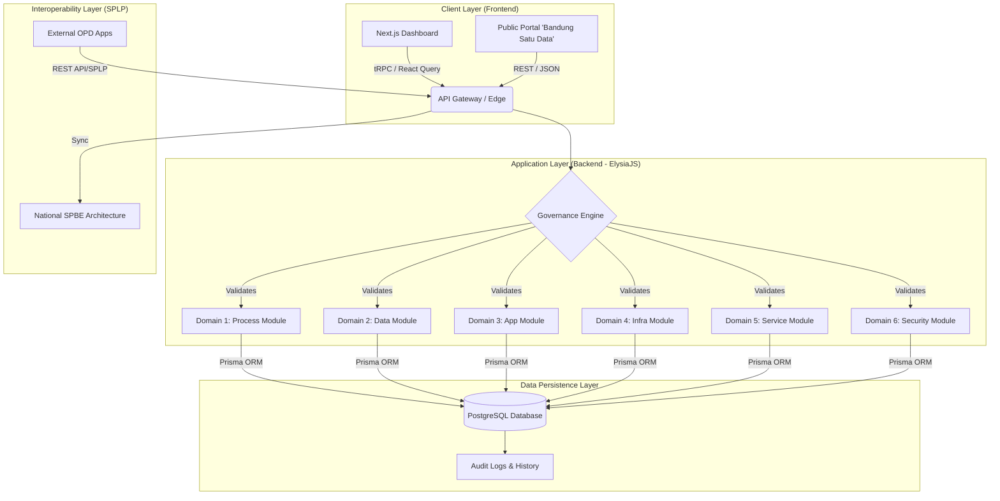

# System Architecture (architecture.md)

**Project:** Bandung Gov-Connect
**Scope:** Integrated SPBE Governance Platform for Kota Bandung
**Compliance Framework:** Perpres 132/2022 (National SPBE Architecture) & Satu Data Indonesia

## 1. High-Level Architecture Overview

The system follows a **Monolithic Repository (Monorepo)** strategy using **Turborepo** to ensure code consistency across the "6 SPBE Domains" required by regulation. The architecture adopts a **Layered Service-Oriented** approach to strictly separate the *Metadata Management* (Governance) from *Service Delivery* (Public Application).

### Architectural Diagram (Conceptual)

## 2. Tech Stack & Implementation Strategy

### 2.1. The Monorepo Structure (Turborepo)
To manage the complexity of inter-domain dependencies (e.g., linking *Business Processes* to *Applications* as required by), the project is structured as follows:

*   **`apps/web` (Next.js 14+):** The primary interface for OPD operators and Diskominfo admins. It renders the visual mapping of the architecture and dashboards for "Peta Rencana".
*   **`apps/server` (ElysiaJS):** A high-performance runtime server. It acts as the **Central Metadata Repository** logic. It handles the validation of metadata standards before they are committed to the database.
*   **`packages/db`:** Shared Prisma schema and client.
*   **`packages/auth`:** Shared Better Auth configuration.
*   **`packages/api`:** Shared tRPC routers and Zod validation schemas to ensure the "Metadata Arsitektur" is consistent across front-end and back-end.

### 2.2. Communication Layer (tRPC & Interoperability)
*   **Internal (App $\leftrightarrow$ API):** Uses **tRPC**. This provides end-to-end type safety, ensuring that the rigid metadata structures defined in *Perpres 132* (e.g., referencing process IDs to app IDs) are strictly adhered to during development.
*   **External (SPLP - Sistem Penghubung Layanan Pemerintah):** ElysiaJS exposes standard **RESTful APIs** generating JSON output. This satisfies the requirement for an **Interface (Antarmuka)** that allows data exchange with the National SPBE portal and other OPD specific applications.

## 3. Module Design (The 6 Domains)

The backend logic (`apps/server`) is divided into controllers corresponding to the mandatory domains defined in the source material.

### Module A: Process & Service Governance (Tata Kelola)
*   **Function:** Maps the hierarchy of Sector $\to$ Affairs $\to$ Function $\to$ Sub-function.
*   **Logic:** Ensures every `Service` (Layanan) is linked to a valid `BusinessProcess` (Proses Bisnis), preventing "Siloed" applications.

### Module B: Data Architecture (Satu Data)
*   **Function:** Acts as the *Walidata* management tool.
*   **Logic:** Enforces data standards (One Data Principles). Before an App is registered, its input/output data must be defined here using standardized metadata.

### Module C: Asset Management (App & Infra)
*   **Function:** Inventory of `Application` and `Infrastructure`.
*   **Logic:** Implements the "Moratorium" check. When an OPD requests a new app, the system queries existing assets to detect duplication before approval.

### Module D: Security & Audit (Keamanan)
*   **Function:** Manages `RiskRegister` and `SecurityAudit` logs.
*   **Logic:** Middleware that logs every transaction (Creation, Read, Update, Delete) to the `AuditLog` table to satisfy *Audit TIK* requirements.

## 4. Security Architecture (Better Auth)

*   **Authentication:** Implements **Better Auth** with PostgreSQL adapter.
*   **RBAC (Role-Based Access Control):**
    *   **Super Admin (Diskominfo):** Full access to define standards and approve architecture.
    *   **OPD Operator:** Can only input/edit data relevant to their specific *Dinas/Badan*.
    *   **Auditor (Inspektorat):** Read-only access to specific audit trails.
*   **Compliance:** Secure session management and password hashing to meet *Domain Keamanan* standards.

## 5. Deployment & Scalability

*   **Infrastructure:** Designed to be containerized (Docker) and deployed on the **Pusat Data Nasional (PDN)** or Local Government Private Cloud (Jaringan Intra Pemerintah).
*   **Performance:** ElysiaJS is chosen for its low overhead, crucial for processing complex graph queries when mapping relationships between hundreds of OPD business processes and applications.

## 6. Integration Roadmap (Peta Rencana)

The architecture supports the "To-Be" planning phase:
1.  **As-Is Capture:** The system allows ingestion of current legacy data (spreadsheets/legacy DBs) via bulk upload scripts in Elysia.
2.  **Gap Analysis:** Automated queries in Prisma to find `Services` that do not have supporting `Applications` or `Data`.
3.  **To-Be Planning:** A staging environment within the DB to model future architecture without affecting the live registry.